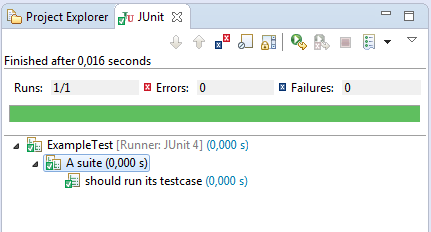

# Java-Jasmine

[](https://travis-ci.org/bvkatwijk/Java-Jasmine)
[](https://codecov.io/gh/bvkatwijk/Java-Jasmine)

## Summary

## Syntax

Extending the JasmineTest class provides convenience methods to implement tests the same way you would in JavaScript:

```
public class ExampleTest extends JasmineTest {{

	describe("A suite", () -> {
		it("should run its testcase", () -> {
			Assert.assertEquals(true, 1 == 1);
		});
	});

}}
```

## Usage

Extending the JasmineTest class also provides a custom JUnit runner which makes the class runnable as a JUnit test class:




